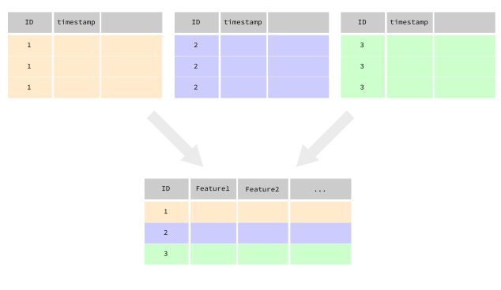

[](https://travis-ci.org/QuayAu/fxtract)
[](https://codecov.io/gh/QuayAu/fxtract)

# fxtract 
This is work in progress!
[Tutorial](https://quayau.github.io/fxtract/docs/index.html)

## Introduction

fxtract helps you to extract user-defined features from longitudinal data with helpful preprocessing functions.



The main idea is that the user should only define a function on a dataset which returns a named vector with the desired features. The whole data wrangling (calculating the feature for each ID, possibly in parallel) is handled by `fxtract`. 

Some helpful functions for preprocessing (timestamped) data are also supplied.

# Installation
For the development version, use [devtools](https://cran.r-project.org/package=devtools):
```{R}
devtools::install_github("QuayAu/fxtract")
```
## Features

* Unit-tested functions.
* Extracting features from longitudinal data of many different users/IDs/etc:
    * Either with the function `calc_feature`.
        * Quick and easy calculation of features just by defining a function on the dataset which has a named vector as output.
    * Or with the R6 Class `project`.
        * For larger projects (many participants, lots of data, many features), it is highly advised to use the R6 class and its methods.
        * Advantages:
            * No more code bloat thanks to R6.
            * Very large datasets are supported, since data is only read into RAM when needed. Minimum requirement: Datasets for each participant individually must be small enough to be read into memory.
            * Internally, [batchtools](https://mllg.github.io/batchtools/articles/batchtools.html) is used for parallelization and error handling.
            * Features can be calculated for each participant individually or in chunks. 
            * If one feature on one participant throws an error, this will not stop the whole process (like in a traditional R script). A log file with the error message is created (by batchtools), and the remaining features will still be calculated. 
            * Individual features can be deleted or updated easily.
            * Calculation of features can be done in parallel and the process can be monitored. It is also possible to stop and return the calculation at a later time.
            * Results can be easily collected in one final dataframe.
* Timestamp to date & time converters:
    * This is useful for filtering datasets, e.g. if one is interested in filtering the morning hours from a dataset, or distinguishing working days from weekends.
* Sliding window function:
    * Applies a function within a sliding window of a dataframe. Either step-size (fixed sample rate) or number of seconds (variable sample rate) can be set by the user.
