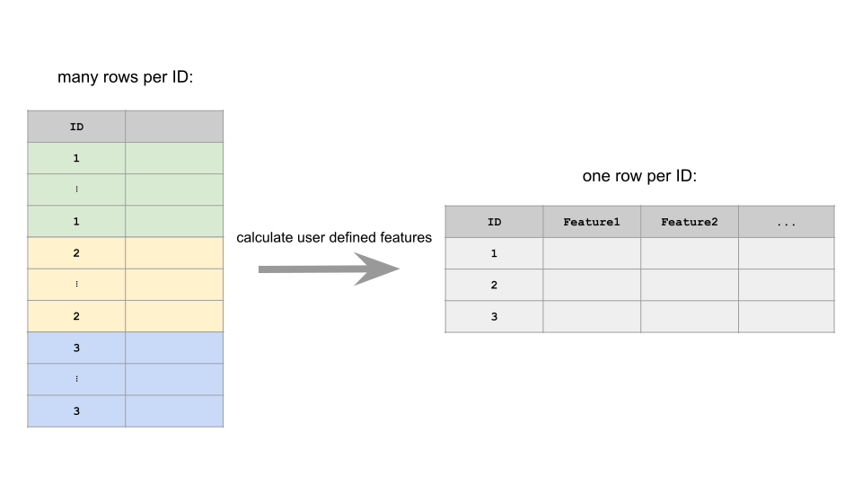

[](https://travis-ci.org/QuayAu/fxtract)
[](https://codecov.io/gh/QuayAu/fxtract)
[](https://ci.appveyor.com/project/QuayAu/fxtract)

# fxtract

Feature extraction is a crucial step for tackling machine learning
problems. Many machine learning problems start with complex (often
timestamped) raw data many grouped variables (e.g. heart rate
measurements of many patients, gps data for analysis of movements of
many participants of a study, etc.). This raw data often times cannot be
directly used for machine learning algorithms. User-defined features
must be extracted for this purpose. Examples could be the heart rate
variability of a patient, or the maximum distance traveled for a
participant of a gps study. Since there are many different machine
learning applications and therefore many inherently different datasets
and features which need to be calculated, we do not supply any automated
features. `fxtract` assists you in the feature extraction process by
helping with the data wrangling needed, but still allows you to extract
your own defined features.



The user only needs to define functions which have a dataset as input
and named vector (or list) with the desired features as output. The
whole data wrangling (calculating the features for each ID and
collecting the results in one final dataframe) is handled by `fxtract`.
This package works with very large datasets and many different IDs and
the main functionality is written in
[R6](https://r6.r-lib.org/articles/Introduction.html). Parallelization
is available via
[future](https://cran.r-project.org/web/packages/future/index.html).

# Installation

For the development version, use
[devtools](https://cran.r-project.org/package=devtools):

``` r
devtools::install_github("QuayAu/fxtract")
```

### Why don’t just use `dplyr` or other packages?

At first glance it looks like we just rewrote the `summarize()`
functionality of `dplyr`. Another similar functionality is covered by
the `aggregate()`-function from the base `stats` package. For small
datasets and few (easy to calculate) features, using `fxtract` may
indeed be a little overkill (and slower too).

However, this package was especially designed for projects with large
datasets, many IDs, and many different feature functions. `fxtract`
streamlines the process of loading datasets and adding feature
functions. Once your dataset (with all IDs) becomes too big for memory,
or if some feature functions fail on some IDs, using our package can
save you many lines of code.

See the [tutorial](https://quayau.github.io/fxtract/) on how to use this
package.

# Usage

``` r
library(fxtract)

# user-defined function:
fun = function(data) {
  c(mean_sepal_length = mean(data$Sepal.Length),
    sd_sepal_length = sd(data$Sepal.Length))
}

# R6 object:
xtractor = Xtractor$new("xtractor")
xtractor$add_data(iris, group_by = "Species")
xtractor$add_feature(fun)
xtractor$calc_features()
xtractor$results
```

    ##       Species mean_sepal_length sd_sepal_length
    ## 1:     setosa             5.006       0.3524897
    ## 2: versicolor             5.936       0.5161711
    ## 3:  virginica             6.588       0.6358796

# Features

  - Unit-tested functions.
  - Extracting features from raw data of many different IDs with the R6
    Class `Xtractor`:
      - No more code bloat thanks to R6.
      - Very large datasets are supported, since data is only read into
        RAM when needed. Minimum requirement: Individual datasets for
        each ID must be small enough to be read into memory.
      - Features will be calculated for each ID individually and can be
        parallelized with the `future`-package.
      - If one feature on one ID throws an error, this will not stop the
        whole process (like in a traditional R script). The remaining
        features will still be calculated.
      - Individual features can be deleted or updated easily.
      - Calculation of features can be done in parallel and the process
        can be monitored. It is also possible to stop and return the
        calculation at a later time.
      - Results can be easily retrieved in one final dataframe.
