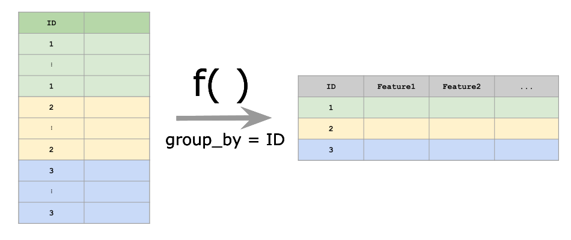

Given a **user-defined** function `fun`, `calc_features` calculates this function for each unique grouping variable (e.g. participants in a study).
The function `fun` needs to be defined on the given dataset and is allowed to return a named vector of arbitrary length.
The dataframe should contain a grouping variable with all the IDs:




## Example data
Let's simulate a simple (absolutely arbitrary!) example dataset.
Two participants with the ID *1* or *2* were given two tasks.
For each task they were given two hours of time. 
A value *x* was measured during this task.
```{r, message = FALSE, warning = FALSE}
library(fxtract)
df = data.frame(id = c(rep(1, 10), rep(2, 10)))
df$task = rep(c(rep("task1", 5), rep("task2", 5)), 2)
df$hour = rep(c(rep("hour1", 3), rep("hour2", 2), rep("hour1", 2), rep("hour2", 3)), 2)
df$x = rnorm(20)
df
```

### Return 1 value each
Let's say we are interested in the maximum value of **x** for each participant. 
We need to define a function, which has a dataframe as input and a named vector as output:
```{r}
fun = function(data) {
  c(max_x = max(data$x))
}
```
Now we can calculate the desired outcome:
```{r}
calc_feature(df, group_by = "id", fun = fun)
```


### Return more values at once
Sometimes calculations can take a long time (e.g. clustering of GPS points) and we want to calculate more than one value (e.g. `mean` and `sd`). This can be achieved by returning a named vector:
```{r}
more_features = function(data) {
  c(max_x = max(data$x), sd_x = sd(data$x))
}
calc_feature(df, group_by = "id", fun = more_features)
```

### Group by two columns
```{r}
calc_feature(df, group_by = c("id", "task"), fun = more_features)
```

### Group by three colums
```{r}
calc_feature(df, group_by = c("id", "task", "hour"), fun = more_features)
```


