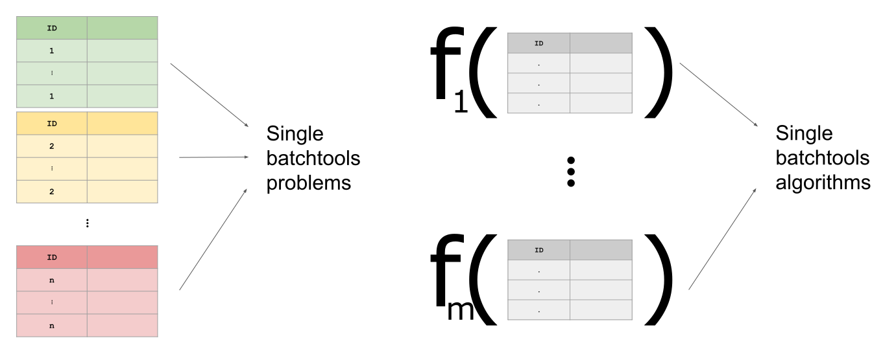

```{r, echo = FALSE}
unlink("projects", recursive = TRUE)
```

- Designed for large projects.
- Data and features can be updated easily.
- Data can be preprocessed.
- Features are calculated on each ID of a grouping variable individually with batchtools.

```{r, message = FALSE}
library(fxtract)
my_project = Project$new("my_project")
```

## Add Data
Data must be added as dataframes with `$add_data`, where the grouping variable must be specified.
You can also add dataframes for each ID individually. This is especially helpful for large datasets.
```{r, message = FALSE, warning = FALSE}
library(dplyr)
iris1 = iris %>% filter(Species %in% c("setosa", "versicolor"))
iris2 = iris %>% filter(Species == "virginica")
my_project$add_data(iris1, group_by = "Species")
my_project$add_data(iris2, group_by = "Species")
```

## Add Features
Features must be added as functions which have a dataframe as input and a named vector as output.
This function will be calculated for each ID of a grouping variable individually.
```{r, message = FALSE}
fun1 = function(data) {
  c(mean_sepal_length = mean(data$Sepal.Length),
    sd_sepal_length = sd(data$Sepal.Length))
}

fun2 = function(data) {
  c(mean_petal_length = mean(data$Petal.Length),
    sd_petal_length = sd(data$Petal.Length))
}
```


```{r, message = FALSE}
my_project$add_feature(fun1)
my_project$add_feature(fun2)
```

## Calculate Features
Features are calculated by the method `$calc_features()`:
```{r, message = FALSE}
my_project$calc_features()
```

## Collect Results
The desired final dataframe can be accessed by the slot `$results`:
```{r, message = FALSE}
my_project$results
```

```{r, echo = FALSE}
unlink("projects", recursive = TRUE)
```


## What Happens Behind the Scenes
Data will be saved as single RDS files for each ID and each dataset is added as one batchtools problem.
Functions are added as batchtools algorithm. 

Every time a dataset or a function is added to the R6 object, batchtools experiments of all possible combinations (problems $\times$ algorithms) are added to the batchtools registry as well. 



A big advantage of this method is that it scales nicely for larger datasets. Data is only read into RAM, when needed.
