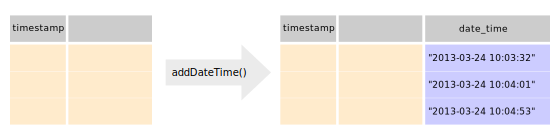

# Date functions

## addDateTime


Given a dataset with a timestamp variable, `addDateTime()` adds a date_time variable from the [lubridate](https://www.rdocumentation.org/packages/lubridate/versions/1.7.4/topics/as_date) package.

## addDate


Given a dataset with a timestamp variable, `addDate()` adds a date variable from the [lubridate](https://www.rdocumentation.org/packages/lubridate/versions/1.7.4/topics/as_date) package.

## addWeekday


Given a dataset with a timestamp variable, `addWeekday()` adds an ordered weekday variable from the [lubridate](https://www.rdocumentation.org/packages/lubridate/versions/1.7.4/topics/day) package.

With this new variable you can filter your dataset very easily. E.g., if you want to filter working days from your dataset, you can easily do this:
```{r, message = FALSE, warning = FALSE}
library(fxtract)
library(dplyr)
data = studentlife.small %>% addWeekday() %>% filter(weekday >= "Mon" & weekday <= "Fri")
unique(data$weekday)
```

## addTime


Given a dataset with a timestamp variable, `addDate()` adds a time variable from the [lubridate](https://www.rdocumentation.org/packages/lubridate/versions/1.7.4/topics/as_date) package.

## addStudyDay

## addStudyDayPerUserId
